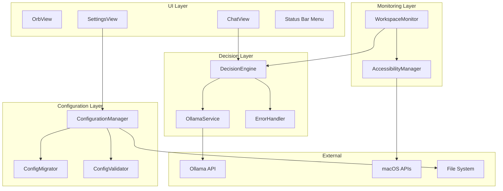

# Design Document: MindGate Production Readiness

## Overview

MindGate is a macOS productivity assistant that monitors active applications and browser tabs to detect distracting content, prompting users to justify access via a local AI evaluation engine (Ollama). This design document specifies the production-ready architecture needed to transform the existing prototype into a robust, reliable application.

### Current State

The existing codebase includes:
- **OllamaService**: HTTP client for Ollama AI inference
- **DecisionEngine**: Evaluates user justifications and manages access grants
- **WorkspaceMonitor**: Detects frontmost app switches and triggers distraction prompts
- **AccessibilityManager**: Reads browser URLs and window titles via macOS Accessibility APIs
- **ConfigurationManager**: Loads and saves `Configuration.json`
- **UI Components**: OrbView (floating orb), ChatView (justification interface), SettingsView

### Production Readiness Goals

This design addresses 15 requirements across:
1. **Connection Resilience**: Timeouts, retries, graceful degradation when Ollama is unavailable
2. **Configuration Robustness**: Validation, migration, import/export, corruption recovery
3. **Error Handling**: Comprehensive error scenarios with clear user feedback
4. **Resource Management**: CPU throttling, memory-bounded monitoring, connection limits
5. **User Experience**: Keyboard accessibility, streaming responses, permission flows
6. **Testing Foundation**: Unit tests and property-based tests for core logic


## Architecture

### High-Level Architecture




### Component Responsibilities

#### OllamaService (Enhanced)
- **Current**: Basic HTTP client with connection checking
- **Enhanced**: 
  - Configurable timeout handling with cancellation
  - Model availability verification via `/api/tags` endpoint
  - Request duration tracking and logging
  - Response validation (non-empty `response` field)
  - Dedicated URLSession with connection pooling (max 2 concurrent)
  - Streaming response support via `AsyncStream<String>`

#### DecisionEngine (Enhanced)
- **Current**: Evaluates justifications, manages access timers
- **Enhanced**:
  - Graceful degradation when Ollama unavailable (returns denial with specific message)
  - Distinguishes AI-based denial vs service-unavailable denial
  - Automatic retry on next request after Ollama recovers

#### WorkspaceMonitor (Enhanced)
- **Current**: Polls frontmost app, checks browser URLs, triggers prompts
- **Enhanced**:
  - Adaptive polling interval (1000ms baseline)
  - Browser check debouncing (750ms threshold)
  - Prompt de-duplication (20-second cooldown per bundle ID)
  - Activity-based idle detection (no unnecessary work after 300s idle)
  - Resource-bounded execution (< 5% CPU averaged over 30s windows)


#### ConfigurationManager (Enhanced)
- **Current**: Basic load/save with default fallback
- **Enhanced**:
  - Field-level validation (URL non-empty, timeout in range, countdown clamped)
  - Auto-correction with persistence
  - Schema versioning with `configVersion` field
  - Migration pipeline for version upgrades
  - Round-trip guarantee for import/export
  - Unknown field tolerance on import
  - Missing field default substitution
  - Notification posting on save failure

#### ErrorHandler (New Component)
- Centralized error handling with categorization
- User-facing error message generation
- Error notification posting to `NotificationCenter`
- Retry strategy coordination
- Error logging with structured metadata

#### ConfigMigrator (New Component)
- Detects configuration schema version
- Applies sequential migrations from loaded version to current
- Writes migrated configuration with updated `configVersion`
- Ensures backward compatibility

#### ConfigValidator (New Component)
- Validates configuration fields against business rules
- Clamps numeric values to acceptable ranges
- Substitutes defaults for empty/invalid required fields
- Returns validation report with applied corrections


## Components and Interfaces

### OllamaService Interface

```swift
enum OllamaError: LocalizedError {
    case invalidURL
    case invalidResponse
    case serverError(Int)
    case invalidResponseData
    case connectionFailed
    case timeout
    case modelNotFound(String)
    
    var errorDescription: String? { ... }
}

class OllamaService {
    private let session: URLSession
    private let configurationManager: ConfigurationManager
    private let logger: Logger
    
    init(configurationManager: ConfigurationManager)
    
    // Generate response with configurable timeout
    func generateResponse(prompt: String) async throws -> String
    
    // Stream response tokens progressively
    func generateResponseStream(prompt: String) -> AsyncThrowingStream<String, Error>
    
    // Check connection with 5-second timeout
    func checkConnection() async -> Bool
    
    // Verify configured model is available
    func verifyModelAvailability() async throws -> Bool
}
```


### DecisionEngine Interface

```swift
struct DecisionResult {
    let isApproved: Bool
    let message: String
    let denialReason: DenialReason
}

enum DenialReason {
    case aiEvaluated        // AI model evaluated and denied
    case serviceUnavailable // Ollama not reachable
    case timeout           // Request timed out
    case countdown         // User didn't respond in time
}

class DecisionEngine {
    private let ollamaService: OllamaService
    private let configurationManager: ConfigurationManager
    private var currentApp: NSRunningApplication?
    private var accessTimer: Timer?
    private var grantedAppIdentifier: String?
    private var accessExpiresAt: Date?
    private var ollamaWasAvailable: Bool = false
    
    func evaluateRequest(userInput: String) async throws -> DecisionResult
    func grantAccess(for duration: TimeInterval)
    func hasActiveAccess(for app: NSRunningApplication) -> Bool
    func cancelAccessTimer()
    func checkOllamaConnection() async -> Bool
}
```


### ConfigurationManager Interface

```swift
// Notification names
extension Notification.Name {
    static let configurationSaveFailed = Notification.Name("ConfigurationSaveFailed")
    static let ollamaModelMissing = Notification.Name("OllamaModelMissing")
}

class ConfigurationManager: ObservableObject {
    @Published var configuration: Configuration
    private let fileURL: URL
    private let validator: ConfigValidator
    private let migrator: ConfigMigrator
    
    init()
    
    func save()
    func resetToDefaults()
    func export(to url: URL) throws
    func `import`(from url: URL) throws
}

class ConfigValidator {
    func validate(_ configuration: inout Configuration) -> [ValidationIssue]
}

class ConfigMigrator {
    func migrate(_ configuration: Configuration, from: Int, to: Int) -> Configuration
}

struct ValidationIssue {
    let field: String
    let issue: String
    let correctedValue: Any?
}
```


### WorkspaceMonitor Interface

```swift
class WorkspaceMonitor {
    private weak var windowManager: WindowManager?
    private weak var decisionEngine: DecisionEngine?
    private let accessibilityManager: AccessibilityManager
    private let configurationManager: ConfigurationManager
    private var observer: NSObjectProtocol?
    private var pollTimer: Timer?
    private var lastCheckedApp: NSRunningApplication?
    private var lastCheckedTime: Date?
    private var activePromptIdentifier: String?
    private var activePromptShownAt: Date?
    private var lastActivityTime: Date = Date()
    
    private let pollInterval: TimeInterval = 1.0
    private let debounceInterval: TimeInterval = 0.75
    private let promptRepeatInterval: TimeInterval = 20.0
    private let idleThreshold: TimeInterval = 300.0
    
    func startMonitoring()
    func stopMonitoring()
    func matchedRestrictedKeyword(in text: String) -> String?
    func isDistractingApp(_ app: NSRunningApplication) -> Bool
}
```


### ErrorHandler Interface

```swift
enum MindGateError: LocalizedError {
    case ollamaConnectionFailed(underlyingError: Error?)
    case ollamaTimeout(duration: TimeInterval)
    case ollamaModelMissing(modelName: String)
    case configurationSaveFailed(path: String, error: Error)
    case configurationLoadFailed(path: String, error: Error)
    case accessibilityPermissionDenied
    case monitoringLoopError(error: Error, retryCount: Int)
    
    var errorDescription: String? { ... }
    var recoverySuggestion: String? { ... }
}

class ErrorHandler {
    static func handle(_ error: MindGateError, context: String)
    static func userFacingMessage(for error: MindGateError) -> String
    static func shouldRetry(_ error: MindGateError, attemptCount: Int) -> Bool
    static func postErrorNotification(_ error: MindGateError)
}
```


## Data Models

### Configuration Schema (Version 1)

```swift
struct Configuration: Codable {
    var settings: AppSettings
    var theme: UITheme
    var configVersion: Int = 1  // New field for migration
    
    static let `default` = Configuration(
        settings: .defaultSettings,
        theme: .defaultTheme,
        configVersion: 1
    )
}

struct AppSettings: Codable {
    var distractingApps: [String]
    var restrictedKeywords: [String]
    var monitoredBrowsers: [String]
    var ollamaURL: String
    var ollamaModel: String
    var ollamaTimeout: Int = 10  // New field (5-60 seconds)
    var accessDurations: [TimeInterval]
    var accessDurationLabels: [String]
    var productiveTasks: [String]
    var productiveApps: [String]
    var justificationCountdownDuration: Int  // Clamped to [5, 60]
}
```

### Validation Rules

- `ollamaURL`: Must be non-empty, default: `"http://localhost:11434/api/generate"`
- `ollamaModel`: Must be non-empty, default: `"gemma3:1b"`
- `ollamaTimeout`: Must be in [5, 60], default: `10`
- `justificationCountdownDuration`: Must be in [5, 60], default: `15`
- `distractingApps`: Each entry 1-255 characters, trimmed
- `restrictedKeywords`: Each entry 1-255 characters, trimmed


### Migration Strategy

**Version 0 → 1:**
- Add `configVersion` field (set to 1)
- Add `ollamaTimeout` field (set to 10)
- Validate and clamp existing fields

**Future Migrations:**
- ConfigMigrator will apply migrations sequentially: V0→V1→V2→...→VN
- Each migration is an idempotent transformation
- Migrated configuration is persisted with updated `configVersion`

```swift
class ConfigMigrator {
    func migrate(_ config: Configuration, from: Int, to: Int) -> Configuration {
        var current = config
        for version in (from + 1)...to {
            current = applyMigration(current, toVersion: version)
        }
        return current
    }
    
    private func applyMigration(_ config: Configuration, toVersion: Int) -> Configuration {
        switch toVersion {
        case 1: return migrateToV1(config)
        default: return config
        }
    }
    
    private func migrateToV1(_ config: Configuration) -> Configuration {
        var updated = config
        updated.configVersion = 1
        // Add default ollamaTimeout if missing
        return updated
    }
}
```

